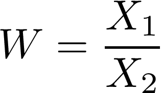

# Beta quotient distribution

According to [1] the probability density function (PDF) of the ratio of two random variables

which each follow the PDFs of beta distributions

and

respectively where the Beta function B(a,b) is

is given by

for 0 < w < 1 and

for w > 1.

The hypergeometric fuctions 2F1 take the form [2]

for w<1 and

for w>1.

Using the fact that

and

one can calculate the integral of the PDF, the cumulative density function (CDF):

for w<1 and 

for w>1.

For the expectation value of a fraction x/y one has:

with 

and 

Hence, as result on obtains 

[1] _Pham-Gia, T. "Distributions of the ratios of independent beta variables and applications." Communications in Statistics-Theory and Methods 29.12 (2000): 2693-2715._

[2] _Luke, Yudell L., ed. Special functions and their approximations. Vol. 2. Academic press, 1969._

---

The two cases ($0<w\leq1$ and $w\geq1$) of hypergeometric functions that will be used below ($1 - \beta_i$ are non-positive). (see page 40, Yudell L. Luke, 1969)

${}_2F_1(\alpha_1 + \alpha_2, 1-\beta_1; \alpha_1 + \alpha_2 + \beta_2; w) = \sum_{n=0}^{\beta_1-1}(-1)^n \begin{pmatrix} \beta_1-1 \\ n\end{pmatrix} \frac{(\alpha_1+\alpha_2+n-1)!\cdot(\alpha_1+\alpha_2+\beta_2-1)!}{(\alpha_1+\alpha_2+\beta_2+n-1)!\cdot(\alpha_1+\alpha_2-1)!} w^n$ for $w<1$

${}_2F_1(\alpha_1 + \alpha_2, 1-\beta_2; \alpha_1 + \alpha_2 + \beta_1; \frac{1}{w}) = \sum_{n=0}^{\beta_2-1}(-1)^n \begin{pmatrix} \beta_2-1 \\ n\end{pmatrix} \frac{(\alpha_1+\alpha_2+n-1)!\cdot(\alpha_1+\alpha_2+\beta_1-1)!}{(\alpha_1+\alpha_2+\beta_1+n-1)!\cdot(\alpha_1+\alpha_2-1)!} \left(\frac{1}{w}\right)^n$ for $w\geq1$

The results for even and odd $n$ are stored separated and substracted in the end each. For purpose of further implementation define the $\log({_2F_1})$.

Here, finally, apply the hypergeometric functions in the quotien distribution (see T. Pham-Gia, 2000):

$f(w) = B(\alpha_1 + \alpha_2, \beta_2) \cdot w^{\alpha_1 - 1} \cdot \frac{{}_2F_1(\alpha_1 + \alpha_2, 1 - \beta_1; \alpha_1 + \alpha_2 + \beta_2; w)}{B(\alpha_1, \beta_1) \cdot B(\alpha_2, \beta_2)}$ for $0 < w \leq 1$

$f(w) = B(\alpha_1 + \alpha_2, \beta_1) \cdot w^{-(1 + \alpha_2)} \cdot \frac{{}_2F_1(\alpha_1 + \alpha_2, 1 - \beta_2; \alpha_1 + \alpha_2 + \beta_1; \frac{1}{w})}{B(\alpha_1, \beta_1) \cdot B(\alpha_2, \beta_2)}$ for $w \geq 1$

The integral of the quotient distribution given above. Here I need to use

$\int w^{a_1 - 1} {}_2F_1(a_1 + a_2, 1 - b_1; a_1 + a_2 + b_2; w)\,\mathrm{d}w = \frac{w^{a_1}}{a_1}\cdot {}_3F_2(a_1, a_1 + a_2, 1 - b_1; a_1 + 1, a_1 + a_2 + b_2; w)$

and

$\int w^{-(1 + a_2)} {}_2F_1(a_1 + a_2, 1 - b_2; a_1 + a_2 + b_1; \frac{1}{w})\,\mathrm{d}w = -\frac{w^{-a_2}}{a_2}\cdot {}_3F_2(a_2, a_1 + a_2, 1 - b_2; a_2 + 1, a_1 + a_2 + b_1; \frac{1}{w})$

Expectation value of fraction a/b: $E\left(\frac{a}{b}\right) = E(a)\cdot E(b^{-1})$

with $E(a) = \frac{a_1}{a_1+b_1}$

and $E(b^{-1}) = \int_{-\infty}^{\infty}\frac{b^{a_2-2} (1-b)^{b_2-1}}{B(a_2-1, b_2) \left(\frac{a_2-1}{a_2+b_2-1}\right)}\,\mathrm{d}b = \frac{a_2+b_2-1}{a_2-1}$

$\Rightarrow E(\frac{a}{b}) = \frac{a_1\cdot(a_2+b_2-1)}{(a_1+b_1)\cdot(a_2-1)}$
